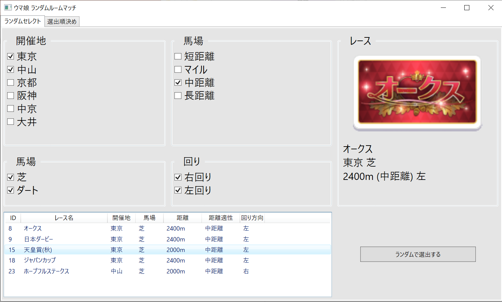

# ウマ娘ランダムマッチングツール
## 概要  
>ジャンル: ツール  
>制作人数: 1人  
>製作期間: 3日  
>制作時期: 3年次  
>>#### 開発環境
>>フレームワーク: WPF(Windows Presentation Foundation)  
>>言語: C#  
>実行環境:  
>>OS: Windows 10  
>>RAM: 8GB  
>>GPU: Intel i5-8250U  
  
## ツール内容  
ウマ娘の中にあるルームマッチでレースをランダムに選択するツール
条件を設定して絞り込んで選択することもできる。  
  
## 開発目的  
ウマ娘でルームマッチが実装されて友達と一緒に遊ぶとき、レースを一つ選んでそれに合わせて育成するという遊びをしていたのだが、
「チャンピオンズミーティングの距離に合わせてやりたいよね」という意見が出てきたので簡易的だがこのツールを作った。
このようなしっかりとしたツールを作るのは初めてだったが完成させることが出来た。  

## 主要ファイル  
>"../UmaMusume_RandomRoomMatch/UmaMusume_RandomRoomMatch/MainWindow.xaml"  
>"../UmaMusume_RandomRoomMatch/UmaMusume_RandomRoomMatch/MainWindow.xaml.cs"  
  
## 頑張った点
- 絞り込み機能
- 絞り込まれたレースの一覧表示
- 選択されたレースを画像と情報で表示させる

## スクリーンショット
  

